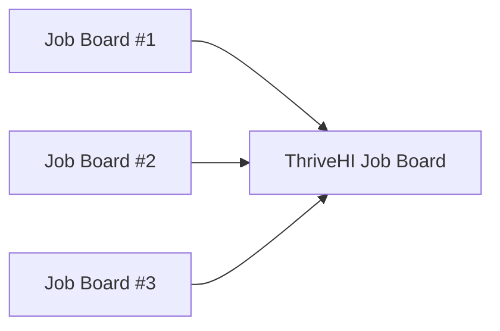
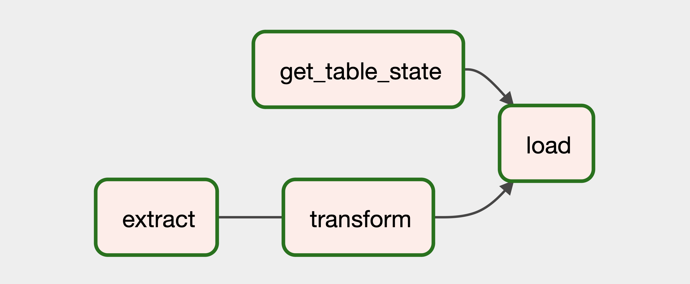
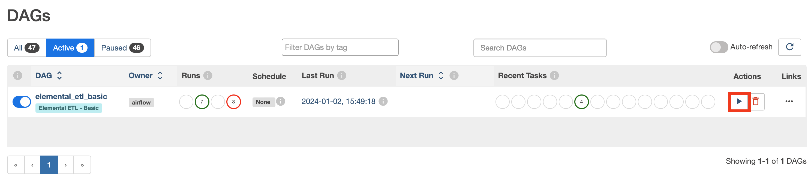

# Thrive Job Board

[ThriveHI](www.thrivehi.org) is a non-profit dedicated to modernizing Hawaii's economy through tech. This repo contains a volunteer project for a ThriveHI website tool. ThriveHI partners with various organizations in Hawaii that have job listings. The Thrive Job Board scrapes these organization websites for jobs, which are then aggregated into a Notion database (embedded in the ThriveHI website). 

This project is also an **instructional tool** for ThriveHI members to learn more about the following data/software engineering principles: Apache Airflow, PostgreSQL, CI/CD with GitLab, package management with Conda, pytest frameworks, object-oriented programming, PEP-8 compliant documentation, etc. 


## Installation
### Step 1: Clone Repository
A git repo is a storage space where your project's files are stored, along with the history of changes made to those files over time. In order to get the code for this project onto your computer, follow the helpful GitHub article [here](https://docs.github.com/en/repositories/creating-and-managing-repositories/cloning-a-repository).

### Step 2: Install Conda Environment, Run Setup
Software projects almost always use software packages written by other people. [Conda](www.conda.org) is a popular tool to manage these packages. Install the correct version of Conda for your machine [here](https://docs.conda.io/projects/conda/en/stable/user-guide/install/download.html). Open the terminal, and navigate to the parent directory of the project `.../thrive-job-board`. Then, run:

```shell
conda env create -n thrive-job-board --file environment.yml
```

This command will install all the relevant packages for the project. Then, again in the command line, run: 
```python
python3 setup.py develop
```

### Step 3: Configure Airflow
Ensure that you have set the `AIRFLOW_HOME` environment variable on your machine by running this in the command line:

```shell
export AIRFLOW_HOME=<thrive-job-board path>/airflow
```

## Code Architecture and Usage
### About the `/job_boards/` directory
The `/job_boards/` directory contains the bulk of the code for this project. This `README` will cover three of them:
1. `job_board.py`
2. `job.py`
3. `transaction.py`

Recall that this project aggregates various job boards of ThriveHI partner organizations like this:



The `job_board.py` file defines the abstract class `JobBoard`, which each different job board class will inherit (for example, `elemental.py`). Here's a [helpful article](https://www.geeksforgeeks.org/abstract-classes-in-python/) to learn more about abstract classes. Each job board class will have custom functions to scrape its corresponding job board website for the correct information. 

After scraping the job boards for jobs, the software will generate instances of the `Job` class defined in the `job.py` file for each job. 

Now, we need to manage all these jobs in a database architecture. This project uses PostgreSQL. The methods for interacting with the PostgreSQL database are defined in `transaction.py`. The `transaction.py` file needs to handle the following cases: 

1. If a job is removed from a source job board, delete from the ThriveHI job board
2. If a new job is added to a source job board, add it to the ThriveHI job board
3. If an existing job's data is changed, change the relevant fields in the ThriveHI job board

### How Apache Airflow Is Used
[Apache Airflow](https://airflow.apache.org/docs/apache-airflow/stable/index.html) is an industry standard tool for managing data pipelines. This project follows the standard "ETL" (Extract-Transform-Load) architecture as seen here: 


*Image from Airflow Web Server*

Airflow pipelines use discrete elements called "tasks", shown in the image above. 
1. The `extract` task scrapes the source job board websites
2. The `transform` task modifies the data to make it work correctly with the database architecture
3. The `get_table_state` task gets the current state of the ThriveHI job board
4. The `load` task leverages the transaction methods in `transaction.py` to correctly remove, publish, and modify records. 

### Running a Pipeline
First, ensure that the postgresql database is running by executing this in the command line: 

```shell
pg_ctl start -D thrive-job-board
```

Then, start the Airflow scheduler by running this in the command line:
```shell
airflow scheduler
```

Start the Airflow web server by running this in the command line:
```shell
airflow webserver -p 8080
```

Run the pipline by clicking the "Run DAG" icon in the web server


Make sure to kill the PostgreSQL server when you're done: 

```shell
pg_ctl stop -D thrive-job-board
```

### Testing
A robust testing suite using pytest is available in the `/tests/` folder. 
